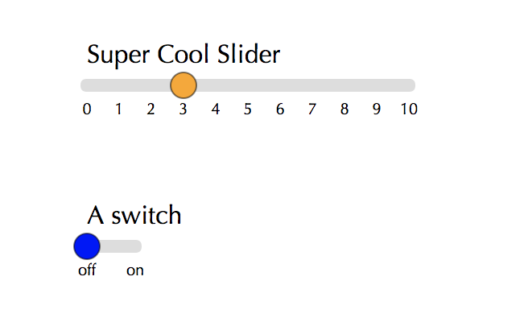

# slid3r
A simple d3 slider that is meant to be placed inside your svg.

## What and Why
`slid3r` is a tiny library that uses d3 to make simple slider inputs. I constantly find myself wanting to implement sliders in
my projects but find that the default html ones are ugly, or if I use some of the better alternatives I have to load JQuery or something
else and bog-down my project. Other [d3-based slider](http://sujeetsr.github.io/d3.slider/) efforts require the slider to be contained in a div, which I find isn't always what I want/need.


A benefit of having the slider implemented straight in the svg is the ability to move it around the visualization programatically using `.attr('transform',...)`.
This is especially useful when you have more complex visualizations with dynamic interfaces.

## In action

[This bl.ock](https://bl.ocks.org/nstrayer/558a63263bd60b3a722c92a2fe338345) demonstrates the minimum viable product for using the library. In addition, [this blogpost](http://livefreeordichotomize.com/2017/08/14/the-exponential-power-series/) I wrote uses it in an intereactive.

## Getting it into your project
Currently the library is bundled to be used in a script tag. If you want to use it just add 
```
<script src="https://rawgit.com/nstrayer/slid3r/master/dist/slid3r.js"></script>
```

somewhere above the javascript you call `slid3r` in. 

## API

Currently you get one single function. That function is `slider()`. Attached to this function are a few getter-setter functions as described in Mike Bostock's [Towards Reusable Charts](https://bost.ocks.org/mike/chart/)
article. An example use of the function is as follows:

```js
const mySlider = slid3r()
    .width(200)
    .range([0,10])
    .startPos(3)
    .label('Super Cool Slider')
    .loc([50, 50])
    .onDone(pos => console.log('slider set to', pos));
  
 svg.append('g').call(mySlider);
```

__Result:__



---

All current options are as follows:

| name      | purpose |     arguments | default |
| --------- | ------- | ------------- | --------|
| .label    | Text for above slider | _string_ | `'choose value'` |
| .range    | Slider's possible values  | _array_ (`[startVal, endVal]`)| `[0,10]` |
| .startPos | Value that the slider starts at | _number_ (in set range) | `0` |
| .clamp    | Should slider report position rounded to nearest integer? | _boolean_ | `true` |
| .width    | Width of slider  | _number_ (represents pixels) | `250` |
| .loc      | Where the slider sits on the svg | _array_ (`[leftEdgeX, topEdgeY]`) | `[0,0]` |
| .onDone   | Callback for after slider is dragged | _function_ (takes position on the slider as first argument) | `(x) => console.log('done dragging', x)` |
| .onDrag   | Called continuously as slider is moving| _function_ (that takes position on the slider as first argument) | `(x) => null` |
| .font     | Font family of the number ticks and label | _string_ (valid css font-family) | `'optima'`
| .animation | Should slider animate the clamping to nearest integer? | _number_ (milliseconds for animation) or false (to disable) | `200` |
